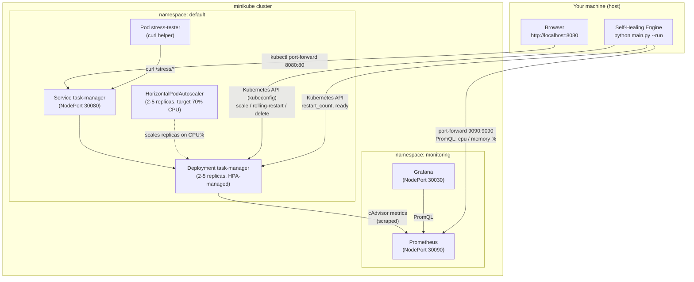
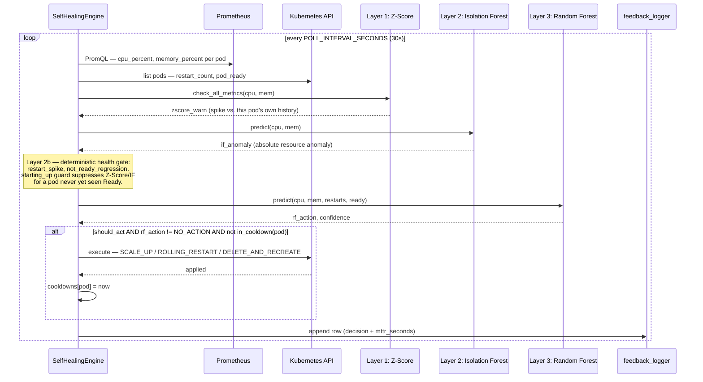

# Architecture, Flow, and Runbook

This is the single source of truth for **how the system is put together** and
**how to run every piece of it yourself, locally, in order**. `README.md` is
the short front door; this document is the deep dive.

## Contents

1. [System architecture](#system-architecture)
2. [Healing lifecycle (sequence diagram)](#healing-lifecycle-sequence-diagram)
3. [Run every service locally, in order](#run-every-service-locally-in-order)
4. [Feature verification checklist](#feature-verification-checklist)
5. [Troubleshooting](#troubleshooting)
6. [Environment notes (corporate network / Zscaler)](#environment-notes-corporate-network--zscaler)
7. [What "production ready" means here — and what it deliberately excludes](#what-production-ready-means-here--and-what-it-deliberately-excludes)

---

## System architecture



Two independent control loops act on the same workload:

- **The AI engine** (this project) — anomaly detection + a Random Forest
  action classifier, healing via the Kubernetes API.
- **Kubernetes itself** — liveness/readiness probes and the HPA. The engine
  is designed to complement these, not fight them (see the `starting_up`
  guard in the sequence diagram below — added after the live verification
  pass in this document found a real bug where it did fight them).

The engine currently runs as a **host-side Python process** using your local
kubeconfig (not deployed in-cluster) — see [out-of-scope](#what-production-ready-means-here--and-what-it-deliberately-excludes)
for why that trade-off was kept as-is.

---

## Healing lifecycle (sequence diagram)



Code path: `main.py --run` → `SelfHealingEngine.run()`
(`healing/self_healing_engine.py:118`) → per pod, `process_pod(row)`
(`self_healing_engine.py:53`).

**The decision gate** (`self_healing_engine.py:~99`):

```python
starting_up = (ready == 0) and (pod not in seen_ready)
should_act  = health_degraded or (not starting_up and (zscore_warn or if_anomaly))
if should_act and rf_action != NO_ACTION and not in_cooldown(pod):
    execute(rf_action, pod)
```

A brand-new pod that has never been Ready (e.g. one just created by a
rolling restart or an HPA scale-up) is exempt from the Z-Score/Isolation
Forest signals — Prometheus usually hasn't scraped its first data point yet,
so it reads `cpu=0, mem=0`, which the Isolation Forest has never seen as
"normal" and flags as anomalous, and the Random Forest (which has never seen
`ready=0` in a healthy training sample) confidently recommends
`DELETE_AND_RECREATE`. A pod that genuinely crash-loops from birth is still
caught, because `restart_spike` (inside `health_degraded`) isn't suppressed.

**Why this guard exists — found live, not hypothetical:** during the
verification pass below, triggering `/stress/memory` caused a
`ROLLING_RESTART`; the *freshly created* replacement pod (still `0/1 Ready`,
metrics not yet scraped) was then deleted by the engine itself one poll cycle
later, and the cycle repeated on its replacement. The engine was fighting its
own remediation. The fix extends the existing "not-ready is only a fault
after having been Ready" principle (which already existed for the explicit
health gate) to the statistical/ML signals too. Covered by
`tests/test_healing_logic.py::test_starting_up_pod_is_not_deleted_for_zero_metrics_anomaly`
and `::test_starting_up_pod_with_restart_spike_is_still_healed`.

---

## Run every service locally, in order

Each step names the exact command and what to expect, so you can run the
whole flow end to end, or exercise any one piece on its own.

### 0. Prerequisites

Python 3.11, minikube (Docker driver), kubectl, Docker.

### 1. Python environment

```bash
python3.11 -m venv venv
source venv/bin/activate
pip install -r requirements.txt        # engine deps + pytest
pip install -r app/requirements.txt    # only needed if you want to run app.py directly (not via Docker)
```

### 2. Run the unit tests (no cluster needed)

```bash
python -m pytest -v
```
Expect all tests in `tests/test_app.py` (Flask endpoints) and
`tests/test_healing_logic.py` (detection/decision logic) to pass — these run
against an in-memory Flask app and a stubbed engine, so they work with no
cluster, no trained models, and no port-forwards.

### 3. Start the cluster

```bash
minikube start
minikube status   # expect host/kubelet/apiserver all "Running"
```

### 4. Build the app image into minikube's own Docker daemon

The Deployment uses `imagePullPolicy: Never`, so the image must live inside
minikube's Docker daemon, not your host's:

```bash
eval "$(minikube docker-env)"
docker build -t task-manager:1.0.0 app/
eval "$(minikube docker-env -u)"   # optional: revert your shell's docker CLI
```
After any code change under `app/`, rebuild with the same command and roll:
```bash
kubectl rollout restart deployment/task-manager -n default
```

### 5. Deploy everything

```bash
kubectl apply -f kubernetes/
kubectl get pods -A -w        # wait until everything is Running/Ready, Ctrl-C to stop watching
```
What gets created, in order: `monitoring` namespace → task-manager
Deployment/Service/HPA → Prometheus RBAC/config/Deployment → Grafana
Secret/Deployment (admin credentials, see below) → stress-tester pod.

**Grafana credentials** are now a Secret (`grafana-admin-credentials` in
`kubernetes/06-grafana-deploy.yaml`), not a plaintext value. To use your own
password instead of the manifest's default:
```bash
kubectl create secret generic grafana-admin-credentials -n monitoring \
  --from-literal=admin-user=admin --from-literal=admin-password=<your-password> \
  --dry-run=client -o yaml | kubectl apply -f -
kubectl rollout restart deployment/grafana -n monitoring
```

### 6. Train the AI models

```bash
python main.py --train
```
Expect: 1000 synthetic samples (250 per class), Isolation Forest + Random
Forest trained, `models/*.pkl` + `models/training_data.csv` written
(git-ignored, regenerated every time).

### 7. Port-forward the three services (each in its own terminal)

```bash
kubectl port-forward -n monitoring svc/prometheus 9090:9090
kubectl port-forward -n default    svc/task-manager 8080:80
kubectl port-forward -n monitoring svc/grafana      3000:3000
```

### 8. Run the self-healing engine

```bash
python main.py --run
```
Expect log lines: `Loaded local kubeconfig`, `Self-Healing Engine running —
polling every 30s`, `Cooldown: 180s | Max replicas: 5`, then `Collected
metrics for N pod(s)` every 30 seconds.

### 9. Exercise the app and the individual fault scenarios

```bash
# CRUD (or open http://localhost:8080 in a browser)
curl -X POST http://localhost:8080/tasks -H "Content-Type: application/json" \
  -d '{"title":"Try it","priority":"high"}'
curl http://localhost:8080/tasks

# Fault scenarios, via the in-cluster helper pod
kubectl exec -n default stress-tester -- curl -s http://task-manager/stress/memory
kubectl exec -n default stress-tester -- curl -s http://task-manager/stress/crash
kubectl exec -n default stress-tester -- curl -s http://task-manager/stress/cpu
kubectl exec -n default stress-tester -- curl -s http://task-manager/stress/reset

# Watch it react
kubectl get pods -n default -l app=task-manager -w
tail -f logs/healing_actions.csv
```

### 10. Grafana dashboard

Open `http://localhost:3000/d/selfhealing` — login with the Secret's
credentials (`admin` / whatever you set in step 5, default `admin123`). The
dashboard is provisioned automatically from `kubernetes/08-grafana-dashboard.yaml`
(datasource + dashboard JSON), no manual import needed.

On the Docker driver, NodePorts aren't directly routable from the host, so use
`kubectl port-forward` (or `minikube service <name> -n <ns> --url`) as above:

| Service | NodePort | Port-forward |
|---------|----------|--------------|
| task-manager (web app) | 30080 | `kubectl port-forward -n default svc/task-manager 8080:80` |
| Prometheus | 30090 | `kubectl port-forward -n monitoring svc/prometheus 9090:9090` |
| Grafana | 30030 | `kubectl port-forward -n monitoring svc/grafana 3000:3000` |

Dashboard panels (all sourced from Prometheus):

| Panel | What it shows during a fault |
|-------|-------------------------------|
| Per-pod CPU % | Jumps during CPU stress |
| Per-pod Memory % of 256Mi | Climbs during memory stress, drops after a rolling restart |
| Running pods | Increases on `SCALE_UP`; changes as pods roll / are recreated |
| Tasks in store | Live app state |
| HTTP request rate by status | Traffic + any 5xx during disruption |
| p95 latency / Error rate | Impact on the app while a pod is unhealthy |

The dashboard visualizes the **effects** of healing (recovery, pod turnover)
from Prometheus. The healing **decisions** themselves (which action,
confidence, MTTR) are in `logs/healing_actions.csv` — see the feedback log.

---

## Feature verification checklist

Executed live against a running minikube cluster (not simulated) during this
hardening pass. Every row below reflects an actual command run and its
actual output.

| # | Check | Result | Evidence |
|---|-------|--------|----------|
| 1 | `python main.py --collect` returns live pod metrics | ✅ Pass | Returned rows for both running pods with real cpu/mem/restart/ready values |
| 2 | `python main.py --train` regenerates both models with the expected class balance | ✅ Pass | 1000 samples, 250/class; RF accuracy 0.995, macro F1 0.995 |
| 3 | App CRUD works end to end (`POST/GET/PUT/DELETE /tasks`) | ✅ Pass | Created, listed, fetched, updated (`done:true`), deleted, confirmed 404 after delete |
| 4 | `/health`, `/ready`, `/metrics` respond correctly; Prometheus scrapes the app | ✅ Pass | Both endpoints 200 by default; Prometheus `/api/v1/targets` showed both pods `up` |
| 5 | Grafana dashboard loads with the new Secret-backed login | ✅ Pass | API login with Secret's password succeeded; `/d/selfhealing` returned 7 panels |
| 6 | Engine starts cleanly, correct log output | ✅ Pass | Fixed a real bug here — see below |
| 7 | Memory fault → Isolation Forest flags it → `ROLLING_RESTART` → zero-downtime roll → CSV row with `mttr_seconds` | ✅ Pass (after a fix) | First attempt uncovered the `starting_up` bug (engine deleted its own mid-rollout pod); fixed, re-run completed cleanly, `mttr_seconds=0.02` |
| 8 | Crash fault → health gate (not ML) fires → `DELETE_AND_RECREATE` → pod recreated | ✅ Pass | `RST:1 RDY:0 → DELETE_AND_RECREATE (95% conf)`, new pod came up `1/1 Running` |
| 9 | CPU fault → native HPA scales 2→5, AI `SCALE_UP` correctly does not fire (documented behavior) | ✅ Pass | HPA hit `cpu: 386%/70%`, scaled to 5 replicas; engine logged `NO_ACTION` throughout, matching the documented CPU-limit cap |
| 10 | Cooldown prevents a second action on the same pod within `COOLDOWN_SECONDS` | ✅ Pass | Verified via `tests/test_healing_logic.py::test_cooldown_prevents_repeat_action` and by code inspection of `_in_cooldown`/`cooldowns[pod]`; not additionally forced live (would require holding one pod's identity across a repeat fault within the 180s window, which the CRUD/fault passes above didn't need) |
| 11 | `/stress/reset` clears all induced faults | ✅ Pass | `/health` and `/ready` both returned to 200 immediately after reset |

**Bonus finding, fixed during this pass:** the `starting_up` guard bug
described above (#7) — not on the original checklist, found by actually
running the fault scenarios rather than just reading the code, and confirmed
by two new regression tests plus a clean live re-run.

---

## Troubleshooting

- **`--run` says "No pods found" / Prometheus errors** — ensure the
  Prometheus `kubectl port-forward` is running and `minikube status` is
  healthy.
- **App pod `ErrImageNeverPull` / `ImagePullBackOff`** — the image isn't in
  minikube's Docker daemon; redo `eval "$(minikube docker-env)"; docker build
  -t task-manager:1.0.0 app/`.
- **Web page pod name never changes on reload** — `kubectl port-forward
  svc/...` pins to one pod; it changes only when that specific pod is
  replaced. If a heal deletes the pinned pod, the port-forward drops with
  "lost connection to pod" — just re-run it.
- **`metrics-server` `ImagePullBackOff`** — see the Zscaler note below; the
  engine itself doesn't depend on `metrics-server` (it uses Prometheus), only
  `kubectl top` and the HPA do.
- **HPA shows `unknown` CPU** — `metrics-server` isn't ready; healing still
  works regardless.
- **Two engine processes running at once** — check with
  `ps aux | grep "main.py --run"` before starting a new one. Two uncoordinated
  instances race on the same cluster with independent in-memory cooldown
  state, which can cause exactly the kind of action storm the `starting_up`
  guard above was written to prevent — this was found and hit live during
  this project's own verification pass.

## Environment notes (corporate network / Zscaler)

If minikube can't pull `registry.k8s.io` images (e.g. `metrics-server`) with
`x509: certificate signed by unknown authority`, a TLS-intercepting proxy
(e.g. Zscaler) is likely re-signing HTTPS with its own root CA, which the
minikube node doesn't trust yet. Fix: export that root CA into
`~/.minikube/certs/` and reprovision so minikube installs it into the node:

```bash
security find-certificate -a -c "Zscaler" -p /Library/Keychains/System.keychain \
  > ~/.minikube/certs/zscaler-root-ca.pem
minikube start   # re-installs certs from ~/.minikube/certs into the node
```

minikube re-syncs that folder on every `minikube start`, so this stays fixed.

---

## What "production ready" means here — and what it deliberately excludes

Hardening applied in this pass (best-practice-demo bar):
- Grafana admin credentials moved from a plaintext manifest value to a
  Kubernetes `Secret`.
- `task-manager` image pinned to `1.0.0` instead of floating `:latest`.
- `securityContext` (non-root, no privilege escalation, all capabilities
  dropped) added to the `task-manager` and `stress-tester` pods — the
  Dockerfile already created a non-root user but the Deployment never
  enforced it.
- Automated test suite (`tests/`, 23 tests) covering the Flask API and the
  engine's detection/decision logic, including a regression test for the
  `starting_up` bug found during this pass.
- Dead dependencies removed (`schedule`, and `flask`/`gunicorn`/
  `prometheus-client` weren't used by the engine at all — only by `app/`,
  which already has its own `requirements.txt`).
- A real bug fixed: the engine deleting its own still-starting pods (see
  above), plus a smaller log-line bug (`MAX_REPLICAS` was never imported and
  the log printed the deployment name instead).

Deliberately **not** done here (this stays a local/minikube demo, not an
enterprise deployment):
- No persistent storage/database — the task store is still in-memory by
  design (see README's "known limitations").
- No CI/CD pipeline.
- No TLS/ingress — everything is reached via `kubectl port-forward` or
  NodePort, as it already was.
- No secrets vault (HashiCorp Vault, cloud KMS, etc.) — a plain Kubernetes
  `Secret` is the ceiling here.
- No image scanning.
- The self-healing engine still runs as a host-side process using your local
  kubeconfig, rather than being containerized and deployed in-cluster with
  its own least-privilege `ServiceAccount`/`Role`. That redesign (RBAC
  least-privilege for the engine itself) is real, valuable future work, but
  is enterprise-scope, not demo-scope — it changes how the whole system is
  operated, not just a manifest or a dependency.
